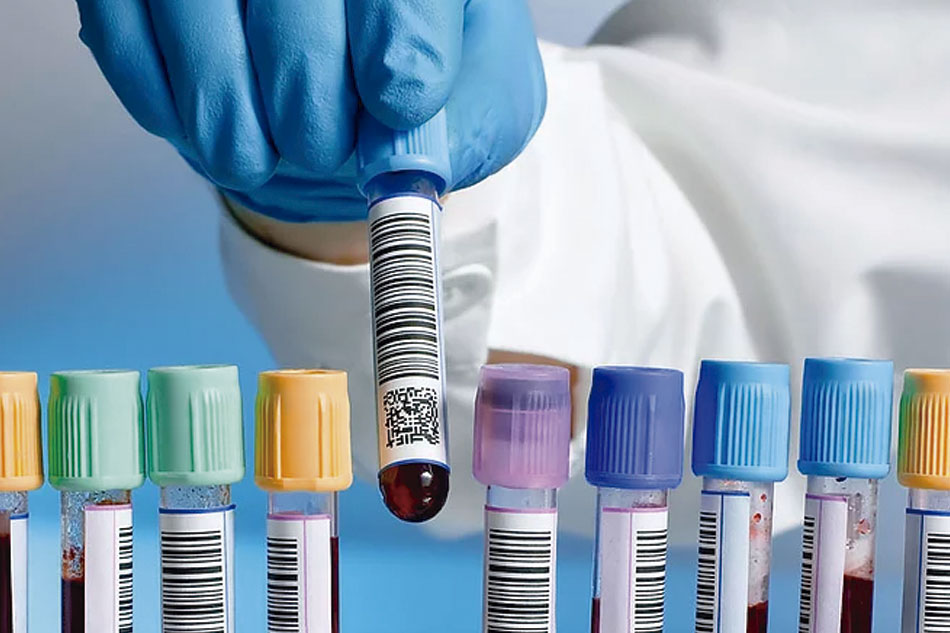

# Turma: SI1N-A

Componentes: Cristian Rudolf Hofmeister

TEMA : Empresa- Laboratório de análises clinicas

A empresa presta serviços de análises clínicas feitas através do estudo de material biológico colhido de pacientes, como por exemplo, sangue, urina, saliva, fezes, esperma, fragmentos de tecido e pus. A coleta pode ser feita no próprio laboratório onde são feitas as análises ou em locais como um hospital, clínica, ou domicilio.

Na empresa existem dois setores, um de atendimento responsável por colher os dados do paciente, agendar visitas e entregar os resultados.
E outro setor responsável por coletar diretamente o material do paciente e realizar a análise do mesmo.
Alguns dos materiais para análises podem ser entregues diretamente pelo paciente ao setor de atendimento que repassará o mesmo para os profissionais responsáveis pela análise.

A adminsitração do laboratorio e feita pelo setor de atendimento.

- Cada paciente pode ser relacionado com varias amostras enquanto as amostras podem se relacionar apenas uma vez com o paciente.
- O analista tem que se relacionar com apenas uma amostra e a amostra prescisa necessariamente se relacionar com apenas um analista.

O banco de dados deve ser capaz de responder às seguintes perguntas:
-
-
-
-
-
